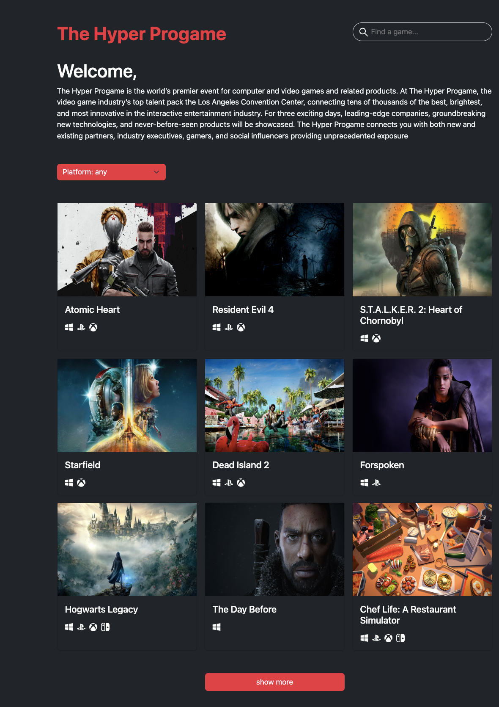
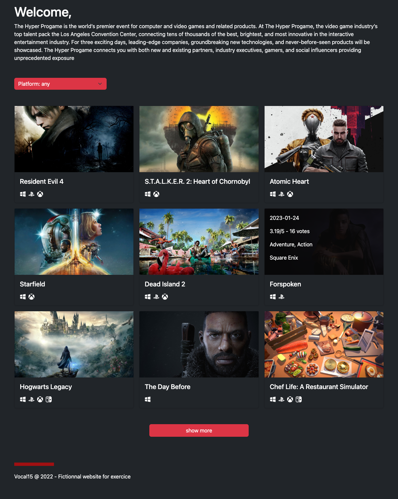
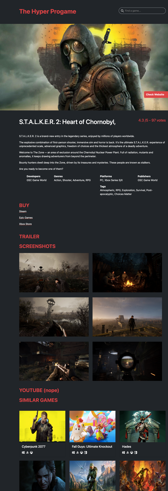

# ProGame : Sortie de jeux vidéos pour l'année 2023 

 

Projet réaliser avec react.js en SPA (Single Page Application). Il a été utilisé dans ce cas l'API RAWG afin de trouver tous les jeux vidéos dont la sortie est prévue au cours de l'année 2023.
Vous arrivez ainsi sur une page d'accueil qui vous propose une liste de jeux vidéos (pouvant être filtrés selon les plateformes), avec des détails accessibles sur cette page au passage de souris. Sur un simple click au titre du jeu, vous pouvez accéder à la "page détail" de ce jeu.
*Les restrictions posées par l'utilisation gratuite de l'API ne permettent pas d'avoir accès aux vidéos.*

Vous pouvez également visiter le site web ici : "https://progame-chris-api.vercel.app"

## Prévisualisation:

### Page d'accueil

### Page d'accueil avec détails supplémentaires au passage de souris

### page detail

 Auteurs de ce projet:

- [@Chreees79](https://github.com/Chreees79)
- [@GuillaumeBrthlt](https://github.com/GuillaumeBrthlt)
- [@linahello](https://github.com/linahello)
- [@xko0](https://github.com/xko0) 
 

## Soutenez-nous!

Donner nous une ⭐ sur Gtihub -- cela aide !

 

